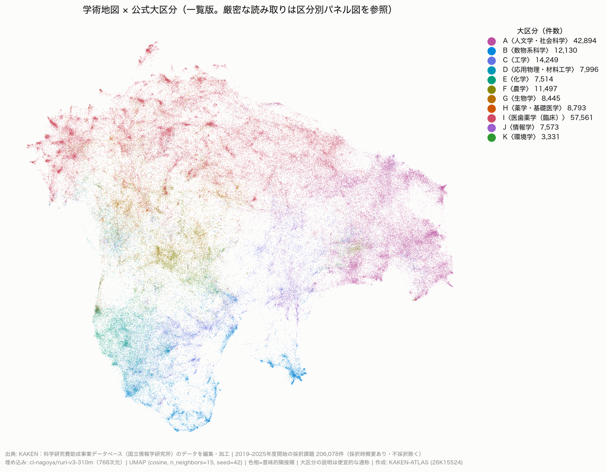
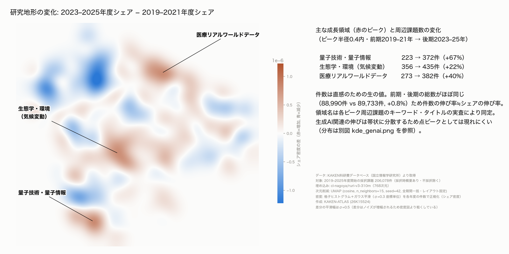

# KAKEN-ATLAS 技術ノート（方法と可視化の設計）

設計の理由と決定事項の記録。**「なぜそうしたか」**を中心に書く。コードの使い方は各モジュールの docstring と `--help` を正とする。
このノートは 3 部構成で、ここは **方法（データ・埋め込み・次元削減）と可視化の設計**。

- **[web.md](web.md)** … 地図サイトの実装と運用（配信構造、Plotly の制約、タッチ操作、Service Worker、検証、版管理、再生成手順）
- **[roadmap.md](roadmap.md)** … R9 以降の設計メモ（クラスタリング、3 指標、距離の定義、機能の構想）。実装が進んだものはここへ昇格させる

- [1. 全体像と設計原則](#1-全体像と設計原則)
- [2. データ取得（fetch）](#2-データ取得fetch)
- [3. パース（parse）](#3-パースparse)
- [4. 審査区分表と大区分ラベル（kubun）](#4-審査区分表と大区分ラベルkubun)
- [5. コーパス（corpus）](#5-コーパスcorpus)
- [6. 埋め込み（embed）](#6-埋め込みembed)
- [7. 次元削減（reduce）](#7-次元削減reduce)
- [8. 配色：意味順色相環](#8-配色意味順色相環)
- [9. 静的図と時系列 KDE](#9-静的図と時系列-kde)
- [10. 地図の読み方と既知の制約](#10-地図の読み方と既知の制約)
- [参考文献](#参考文献)

---

## 1. 全体像と設計原則

```
KAKEN opensearch API ──fetch──▶ data/raw/opensearch/<年度>/*.xml   （不変・9.6GB・238,997件）
        │
      parse ──▶ data/interim/awards.parquet                          （全件・フィルタなし）
        │
      corpus ──▶ data/processed/corpus.parquet                        （206,078件・埋め込み対象）
        │
      embed（Ruri v3 310m, GPU）──▶ data/processed/embeddings.parquet （768次元・L2正規化）
        │
      reduce（UMAP）──▶ data/processed/umap2d_*.parquet / umap3d_* / umapsphere_*
        │
   ├─ scripts/plot_map*.py, plot_kde_years.py ──▶ reports/figures/   （静的図・動画、git 管理外）
   └─ scripts/build_web_map.py ──▶ docs/map2d | map3d | globe        （GitHub Pages）
```

守っている原則：

- **生データは不変**。`data/raw/` は取得したまま置き、再パースで何度でも作り直せる。
- **パース段階ではフィルタしない**。不採択（declined）除外や年度絞り込みはすべて下流（corpus）で行い、
  列（`status_code`、`shokubun_codes` など）で判断できるようにする。
- **決定は再現できる形で残す**。乱数シード固定、パラメータをファイル名に含める
  （`umap2d_nn15_md0.1.parquet` = n_neighbors=15, min_dist=0.1）、図に出所・件数・パラメータを焼き込む。
- **距離の空間を混ぜない**（[§7](#7-次元削減reduce)、[roadmap.md](roadmap.md)）。
- 秘密情報（API の appid）は `.env` のみ。`data/` と `reports/` は git 管理外。
- **研究者名・所属機関を地図に載せない**（2026-09-09 決定）。点の配置は研究内容だけ、色は公式区分だけ。名前や機関の先入観なしに
  研究内容で学術を俯瞰してもらうための方針で、個人・機関の情報は各課題から KAKEN へのリンク先に委ねる。
  公開データ（`docs/shards/`）にも氏名・機関は含めていない。

環境は uv + Python 3.12 固定。3.12 なのは GPU クラスタ側の CUDA ホイールの安定性のため
（`pyproject.toml` の `tool.uv.sources` で Linux の torch を cu128 ビルドに固定している。
ノードのドライバが CUDA 12.9 世代で、PyPI 既定の CUDA 13 ビルドが動かなかった）。

## 2. データ取得（fetch）

`src/kaken_atlas/fetch.py`

- エンドポイントは KAKEN の opensearch API（`https://kaken.nii.ac.jp/opensearch/`、`format=xml`）。
  返る XML は KAKEN ウェブの検索結果エクスポートと同じ `grantAward` 構造。
  仕様は NII 公開の [niijp/kaken_definition](https://bitbucket.org/niijp/kaken_definition)。
- **年度で分割して全件取得**：`s1=s2=<年度>, o1=1`（助成開始年度一致）で年度ごとに切り、
  `rw=500`・`st` オフセットでページング。1クエリの取得上限が 200,000 件なので年度分割は必須。
- 取得済みページは自動スキップし、途中で止めても再実行できる。`--delay` で礼儀的な間隔を入れる。
- **落とし穴**：`rw` は 20/50/100/200/500 のみ有効で、**それ以外の値だとエラーにならず 0 件が返る**。
  小さい `rw` で疎通確認をすると「認証が通らない」と誤診する（実際に一度誤診した）。
- 取得範囲は **2018 年度開始以降**。2018 年の審査区分改革で大区分 11／中区分 65／小区分 306 の
  体系が導入され、それ以前の課題は小区分を持たない。本プロジェクトの主題は「306 小区分からの乖離」
  なので、比較対象にならない期間は取らない。
- 結果：2018〜2025 年度開始で **238,997 件**、483 ページ、9.6GB。

## 3. パース（parse）

`src/kaken_atlas/parse.py` → `data/interim/awards.parquet`

主要列：`award_number`、`kaken_id`、`title`、`keywords`（リスト）、`category`（種目）、
`review_sections`（審査区分の文字列リスト）、`shokubun_codes`（5桁コードのリスト）、
`status_code`、`abstract_initial`（採択時の研究概要）、`abstract_achievement`（成果概要）、開始／終了年度。

XML の勘所（誤読しやすい点）：

- 研究者の同一性は `summary/member@eradCode`（8桁 e-Rad 番号）。`memberList/member@id` は
  課題ごとのレコード id で人を表さない。
- 審査区分は `summary(ja)/review_section` の**テキスト**（例「小区分37010:分子生物学関連」）から
  5桁コードを正規表現で取る。`@niiCode` は内部 id で区分番号ではない。
- 研究概要は `paragraphList@type` が `outline_of_research_initial`（採択時）と
  `outline_of_research_achievement`（成果）の2種類。**採択時概要は 2019 年度採択分からしか存在しない**
  （2018 年度開始の 29,263 件中 863 件のみ）。
- 種目名は全角括弧の揺れ（基盤研究(Ｃ)）を正規化する。
- `projectStatus@statusCode = declined` は不採択で、実際の課題ではない。

## 4. 審査区分表と大区分ラベル（kubun）

`data/reference/kubun_table.csv` / `.json`（正典、git 管理）、`scripts/build_kubun_table.py`、`src/kaken_atlas/kubun.py`

- 表は NII 公式マスタ [niijp/grants_masterxml_kaken](https://bitbucket.org/niijp/grants_masterxml_kaken) の
  `review_section_master_kakenhi.xml`（2018-04-01 施行）から生成。小区分の「内容」キーワードは
  別途保有していた表を突き合わせ、実データ 23.9 万件と全数照合済み。詳細は同ディレクトリの README。
- **小区分コードは 5 桁ゼロ埋めの文字列**として扱う。数値化すると先頭ゼロが落ちる。
- 14 の小区分は複数の中区分（＝複数の大区分）に属する。tidy 形式の CSV では複数行になる。

大区分ラベルは `load_dai_labels()` に一本化し、審査区分の **3 階層を種目に応じて解釈**する：

| 種目 | 審査区分の粒度 | 解釈 |
|---|---|---|
| 基盤研究(B)(C)・若手研究 など | 小区分 | 小区分 → 大区分 |
| 基盤研究(A)・挑戦的研究 など | 中区分 | 中区分 → 大区分 |
| 基盤研究(S) | 大区分 | そのまま |
| 研究活動スタート支援 | 独自の 4 桁区分 | 「区分なし」 |
| 特別研究員奨励費・新学術領域・学術変革 など | 区分なし | 「区分なし」 |

複数の大区分にまたがる場合は「複数」。埋め込みコーパス 206,078 件のうち単一の大区分を持つのは約 18.2 万件。
「複数」「区分なし」は地図ではグレーで描く。

## 5. コーパス（corpus）

`src/kaken_atlas/corpus.py` → `data/processed/corpus.parquet`（**206,078 件**）

フィルタ（確定事項）：

1. 開始年度 2019〜2025。**2018 年度は除外**。採択時概要がなく成果概要しかないため、
   「提案文」と「成果報告文」を混ぜると系統的な偏りが入る。
2. `status_code != declined`（null は残す。granted / project_closed / discontinued 等は採択された課題）。
3. `abstract_initial` があるもの（2019 年度以降 209,734 件のうち 206,906 件＝98.7%）。

埋め込みテキスト `text` ＝ タイトル＋キーワード（「、」連結）＋採択時概要 を改行で連結。
Ruri v3 のクラスタリング用途は空プレフィックス（意味エンコード）モードなので接頭辞は付けない。
トークン数は Ruri v3 の実トークナイザで実測して `n_tokens` 列に持つ：中央値 168、p99 261、最大 661。
上限 8192 に対して十分に短く、切り詰めは起きない。

一部の課題（国際先導研究など）は英語のみのタイトル・概要だが、そのままコーパスに含めている。
**配分額は使わない**（この分析には情報量がないという判断）。**種目は重要な層別変数**として保持する。

## 6. 埋め込み（embed）

`src/kaken_atlas/embed.py` → `data/processed/embeddings.parquet`（561MB、`award_number` + float32×768、行順は corpus と同一）

- モデルは [cl-nagoya/ruri-v3-310m](https://huggingface.co/cl-nagoya/ruri-v3-310m)（768 次元、ModernBERT-Ja、
  最大 8192 トークン、Apache-2.0）。申請書記載の `cl-tohoku/bert-base-japanese-v3` から性能優先で変更した。
  日本語埋め込みベンチマーク JMTEB で当時最高水準、次元数 768 が申請書の記述とも一致、
  ライセンスが公開ウェブアプリ計画と両立する（候補だった Sarashina-Embedding は非商用ライセンスのため不採用）。
- 出力は **L2 正規化**する。これにより内積＝コサイン類似度、ユークリッド距離もコサインと単調になり、
  UMAP・HDBSCAN・各指標が一貫して「向き＝意味」を扱える。
  正規化前のノルムは 25〜29（変動係数 2.4%）でほぼ定数、かつコサイン損失で学習されたモデルでは
  長さは監督されていない副産物なので、情報として使わない。
- デバイスは cuda > mps > cpu を自動判別し、同じコードでローカルのスモークテスト（`--limit`）と
  GPU クラスタの本番を賄う。本番は NVIDIA A40 1 枚で **29 分**（121 texts/s、`scripts/hakusan_embed.sh`）。

**埋め込み空間の性質（実測、設計判断の根拠）**：

- 全課題ペアのコサイン類似度は中央値 **0.72**（p5 0.68、p95 0.78）。768 次元球面に一様なら 0 付近のはずで、
  全ベクトルが狭い錐に集中している（Transformer 埋め込みの既知の異方性）。
  → **類似度の絶対値は解釈しない**。常に相対値・順位で使う。
- 1 点から全件への距離ヒストグラムは一山型で、クラスタ構造は「方向」の違いなので距離に射影すると消える。
  20.6 万件が類似度幅 0.25 に収まり、大半が ±0.05 の帯にある。
  → 生の 768 次元で密度クラスタリングをしても「標高差」が出ない。**UMAP を挟む**定量的根拠。

## 7. 次元削減（reduce）

`src/kaken_atlas/reduce.py` → `data/processed/umap{2d,3d,sphere}_*.parquet`

- `metric="cosine"`、`random_state=42` 固定。シード固定で UMAP の並列最適化が切れて遅くなるが再現性を優先。
  全件 2D は M3 MacBook Air で約 2 分。
- 可視化用は `n_neighbors=15, min_dist=0.1`（2D・3D とも）。
- **球面版**（`--sphere`）は `output_metric="haversine"` で出力空間を球面距離にし、極角・方位角を
  単位球面上の xyz に変換する。**本番は `--min-dist 0.0 --spread 0.3`**（全件約 8 分）。
  既定の `spread=1.0` だと球面の一周 2π に対して広すぎ、点が一様に広がって粗密が消える
  （局所密度の p90/p10 が 3。平面 2D は 8。spread=0.3 で 17 になり「大陸と海」が出る）。
  `repulsion_strength` を下げる案は一極に潰れるので不可。
- 球面の利点は端がないこと（平面 UMAP の周辺部の引き伸ばし・切断がない）。
  代償として球の縁は見かけ密度が 1/cosθ で上がる（回して中央で見る前提）。

**球面版は「平面地図を球に貼った」ものではない**（よくある質問）。PCA のような線形分解は高次元の点群を
軸に射影するだけなので、出力に周期性（一周して戻る性質）を持ち込めず、後から球に貼っても継ぎ目でつながるだけになる。
UMAP は分解ではなく最適化で、①高次元（768 次元・コサイン）で近傍グラフを作り、②低次元の面の上で点を動かして
同じ近傍関係になるよう調整する。`output_metric="haversine"` はこの②で使う距離を平面の直線距離ではなく
**球面上の大円距離**にする設定で、目的関数と勾配そのものが周期性を含む（umap-learn は出力座標を極角・方位角として持ち、
大円距離の勾配で更新する）。したがって「東の端を越えると西に出る」性質は配置の最適化の段階から織り込まれている。
一方、各課題の埋め込みベクトル（Ruri、L2 正規化済み）は表示の球面とは無関係で、入力側の距離がコサイン
（768 次元の単位超球面上の角度）であることと、出力が 2 次元球面であることの間に対応関係はない。

UMAP で**保存されるのは局所近傍関係だけ**。クラスタ間の距離やクラスタの面積は解釈しない。
クラスタリング前段の UMAP（10〜50 次元、`min_dist≈0`）は可視化用とは目的が違うので別にかける（[roadmap.md](roadmap.md)）。

## 8. 配色：意味順色相環

`scripts/plot_map_dai.py` の `DAI_COLORS`（`kaken_atlas.kubun` からも参照）

大区分 11 色は「近い分野ほど近い色相」になるように決めた：

1. 768 次元での大区分重心間の距離行列を作る。
2. 11 点の最短巡回路を Held-Karp（厳密解）で求める：A→J→C→B→D→E→K→F→G→H→I→A。
3. その順に OKLCH 色相環へ等間隔に配置（L=0.60、C=0.17、一部ガマットクリップあり）。
   回転は I=赤・G=緑・A=青という慣習的アンカーへの最小二乗で決める。

色を混同しやすい組が意味的にも近い組になるため、誤読が大きな誤りになりにくい。
11 色の同時識別は保証外で、精読は大区分別パネル図（facets）を正とする。

**既知の問題（未対応）**：明度を揃えて色相だけで区別しているため、赤緑系の色覚特性（1型・2型）では
F〈農学〉・G〈生物学〉・H〈薬学〉がほぼ同色、B・C・J も近づく（Machado 2009 のシミュレーションで確認）。
地図では大区分ごとの単独表示で補える。改善案は色相環の順序を保ったまま隣接色の明度を交互に振り、
「色覚配慮」トグルで切り替えること。

## 9. 静的図と時系列 KDE

`scripts/plot_map.py`（密度）、`scripts/plot_map_dai.py`（大区分パネル・一覧）、`scripts/plot_kde_years.py`（年度別）
→ `reports/figures/`（git 管理外。公開用に選んだものだけ `doc/figures/` に置く）

全図に出所・件数・年度・パラメータの脚注を焼き込む。

時系列 KDE の設計原則：

1. **レイアウトは全期間一括の UMAP で固定**し、年度ごとの点集合で濃度だけを変える
   （年別に UMAP を回すと配置が変わり比較にならない）。
2. 年度の採択数（2.5〜3.6 万件）に引きずられないよう、各年度の密度は件数で正規化した**シェア密度**にする。
3. 動画は密度でなく**偏差**（各年度シェア − 全期間平均、または対 2019 累積）を描く。
   密度そのものは年々ほぼ不変で、動画にしても動かない。
4. 偏差は **|偏差| > 2σ のみ着色**。σ は年度内を半分に割ったブートストラップで画素ごとに推定する。
   σ=0.5 程度の年次揺らぎの大半は標本ノイズなので、閾値なしでは意味のない模様が出る。
5. クロスフェードは演出であり中間状態の推定ではない旨を脚注に明記。

配色は差分・偏差とも赤＝増加／青＝減少で統一。横長図は左＝地図・右＝説明の分離レイアウト。





## 10. 地図の読み方と既知の制約

この地図で信頼できるのは「近いものは近い」という局所的な関係だけである。読み方の原則：

- **遠さ・面積・空白の形に意味はない**。離れた大陸同士の距離、大陸の面積、半島の長さは解釈できない。乱数シードやパラメータを変えると形は変わる。
- **空白は「近傍グラフの断絶」であって未開拓領域ではない**。二つの大陸の間に空白があるのは、その間を近傍でたどる鎖がほとんどないことを意味する。
  空白の**中**に課題を想定するのではなく、空白の**両岸**の関係（大陸間の近傍リンク数、最短路の長さ）を見る。
  小さなスケールの穴やリングは実在し得るが、シード・近傍数・パーシステントホモロジーで安定性の確認が要る。
- **色＝公式の審査区分、配置＝概要文の意味**。色が混ざる場所は誤分類ではなく、区分の境界が概要文の上では曖昧な場所。
  同じ区分が複数箇所に現れるのは、その区分の中に異なる研究群があることの表示。
- **課題間の距離は 768 次元のコサインで測る**（地図上ではない）。類似度の絶対値は解釈せず順位で使う（§6）。
  「面に沿った道のり」（近傍グラフの測地距離）や「密度を速度場とする所要時間」は [roadmap.md](roadmap.md) を参照。
- 球面版の南半球の海は spread と有限面積の帰結で、「研究がない」意味ではない（§7）。北・南・中心に意味はない。

既知の制約：

- **概要文の性質**：採択時概要は申請書の要約で、実際の研究内容や成果とはずれる。成果概要で別コーパスを作る案はあるが、
  2 種類を混ぜてはいけない。
- **英語のみの課題**：一部は英語テキストで、Ruri は日本語向けなので配置の妥当性は日本語より低い。
- **UMAP の限界**：局所構造以外（クラスタ間距離・面積）は解釈しない。周辺部は引き伸ばされる（球面版はその代わり縁の見かけ密度が上がる）。
- **色覚**：[§8](#8-配色意味順色相環) の未対応事項。
- **研究者名・所属機関は載せない**方針（§1）。実務での必要は、利用者が手元データを持ち込むレイヤで応える（[roadmap.md](roadmap.md)）。
- 実装上の制約（Plotly、転送量、端末保存）は [web.md](web.md) を参照。

## 参考文献
